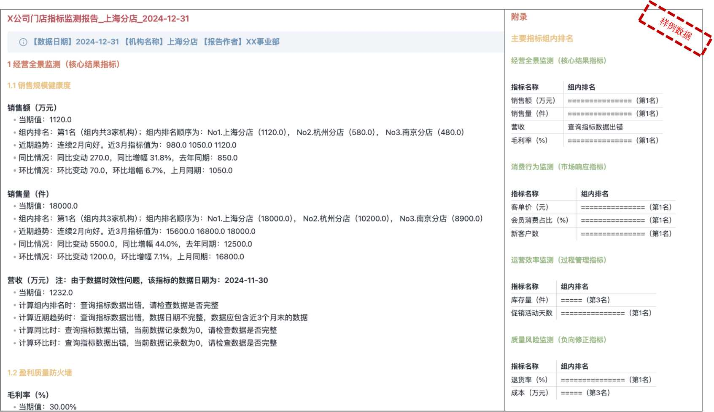
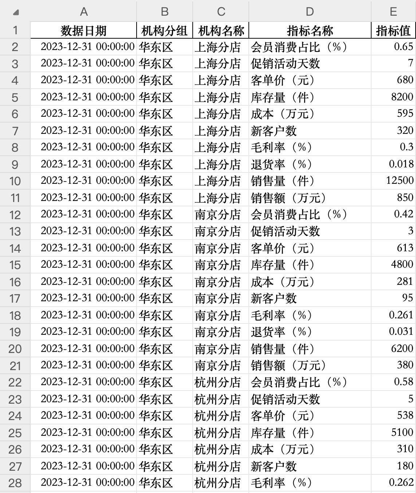
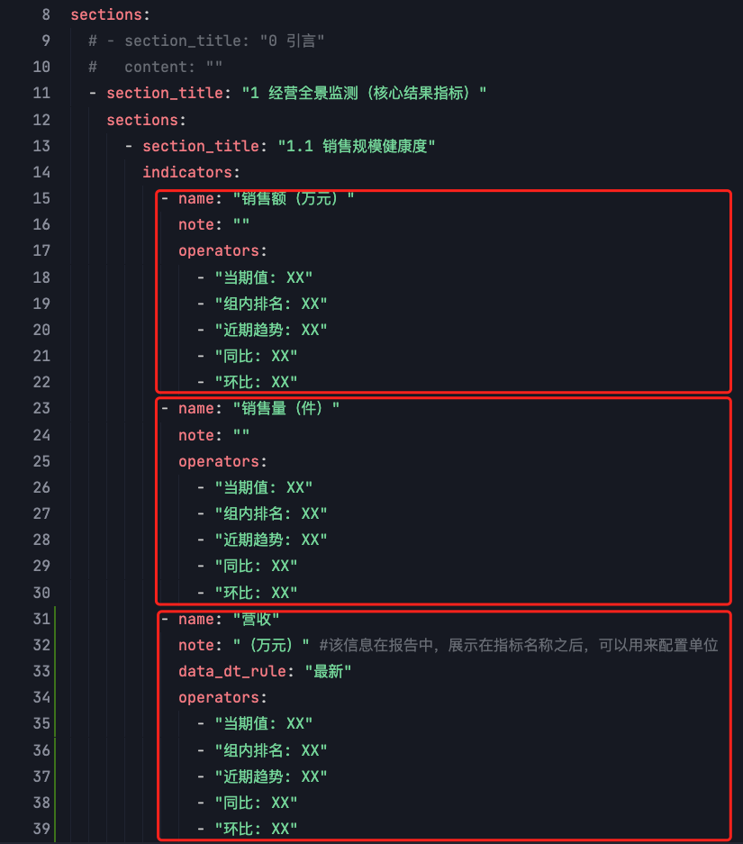

# AA（Automated data Analysis tool）——自动化数据分析工具


## 1.项目简介
数据分析师的是”重脑力“工作者！数据采集、数据解读、得出结论，每个步骤都消耗着数据分析师大量时间和精力。其实，每次分析大量的工作都是重复的，因为每个行业基本上都有自己的经营分析逻辑，数据分析师每次都套用这套逻辑，检查业务指标的变动，最后选择业务发展中的亮点与不足，形成分析报告。如果将这一过程进行归纳总结，利用工具形成自动化的流程，将大大提升数据分析工作的效率。

AA是一款自动化数据分析工具，适用于在企业内部，对企业所辖的各经营机构的业务指标进行自动化监测分析，生成指标监测报告，AA有以下特点：
- **数据处理自动化**，可适配各类手工报表或者标准数据表，通过配置，将数据抽取、清洗、整合的过程流程化、标准化；
- **指标监测自动化**，通过配置监测模板，自动监测指标变动，提高对指标变动、解读的效率，释放人力；
- **分析结果智能化**，与AI结合后，提高业务分析的质量和效率。用户可以将生成的指标监测报告提交给AI大模型（如Deepseek-R1），让大模型对分析报告进行总结提炼，总结业务发展的亮点与不足，形成关键分析结论。
### AA的使用步骤

一开始学习曲线有点陡峭，一旦掌握，效率飞起！😄
## 2.快速开始
### 安装 (提供windows macOS 两个平台的安装指引 )
#### Windows用户适用
````Shell
windows下pip安装依赖有问题
缺少c编译环境，调查pip install numpy的过程
````
#### MacOS用户适用
```Shell
# 1.从github下载AA
git clone https://github.com/fancyfreeman/AA.git

# 2.安装python，检查python版本，要求使用 python 3.10+ 以上版本，下载地址 https://www.python.org/downloads/
python -V
Python 3.13.2

# 3.创建python虚拟环境
cd AA                     # 进入工具目录
python -m venv .venv      # 创建虚拟环境 .venv
source .venv/bin/activate # 激活虚拟环境 如需取消激活虚拟环境 执行 deactivate

# 4.安装依赖包 
cd AA
pip install -r requirements.txt

```
### 运行（以使用样例数据为例进行说明）
```Shell
cd AA
python ./src/main.py -T 1
```
### 查看指标监测报告
用支持markdown格式的编辑器打开报告，推荐使用Obsidian，VS Code等工具

## 3.项目的目录结构
```
.                                                              
├── config                                                     # 配置文件夹
│   └── X公司样例_零售业                                         # 样例配置项目目录
│       ├── data_extraction_config_X公司样例_零售业.xlsx         # 数据预处理配置文件
│       └── report_config_X公司样例_零售业_分店.yaml              # 指标监测报告模板
├── data                                                       # 数据目录
│   ├── processed                                              # 数据预处理目录
│   │   └── data_preprocessed.xlsx                             # 数据预处理结果
│   └── raw                                                    # 原始数据目录
│       └── X公司样例_零售业                                     # 样例原始数据目录
│           ├── X公司样例_零售业_标准表数据.xlsx                   # 样例原始数据（标准表数据）
│           ├── X公司样例_零售业_月报2024-11-30.xlsx              # 样例原始数据（手工报表数据）
│           └── X公司样例_零售业_月报2024-12-31.xlsx              # 样例原始数据（手工报表数据）
├── docs                                                       # 文档目录
├── README.md                                                  # 项目简介
├── reports                                                    # 指标监测报告目录
│   ├── X公司门店指标监测报告_广州分店_2024-12-31.md                # 指标监测报告
│   ├── X公司门店指标监测报告_杭州分店_2024-12-31.md                # 指标监测报告
│   ├── X公司门店指标监测报告_南京分店_2024-12-31.md                # 指标监测报告
│   ├── X公司门店指标监测报告_厦门分店_2024-12-31.md                # 指标监测报告
│   ├── X公司门店指标监测报告_上海分店_2024-12-31.md                # 指标监测报告
│   └── X公司门店指标监测报告_深圳分店_2024-12-31.md                # 指标监测报告
├── requirements.txt                                           # 项目依赖
└── src                                                        # 源文件
    ├── aa                                                     # 程序包
    └── main.py                                                # 程序主入口
```
### 重要目录说明
- config/ 是配置文件目录，内有子文件夹：
	- 存放数据预处理配置文件（如 data_extraction_config_X公司样例_零售业.xlsx）
	- 存放指标监测报告模板（如 report_config_X公司样例_零售业_分店.yaml）
- data/raw 是原始数据目录，内有子文件夹，该目录存放原始Excel数据文件
- reports/ 是指标监测报告目录
## 4.使用说明
### 第1步：数据预处理
#### （1）配置数据预处理
在数据预处理配置文件中，一共可以配置7类信息，对应7个sheet：


7类配置信息是：
- multi_sheet_df 用于配置标准表
- single_sheet_df 用于配置手工表，如没有手工表，可不配置
- 机构分组 用于配置机构分组，必须配置
- 过滤机构 用于配置需要过滤的机构名称，非必须
- 机构名替换 用于规范机构名称，非必须
- ASC_ORDERED_KEYWORDS 配置需要按升序排名的指标，如退货率，非必须
- PERCENTAGE_KEYWORDS 配置需要按百分比展示的指标，展示效果为 XX%，非必须

假设有一家X公司，从事2C的零售业务，我们要收集这家公司的营业指标数据，进行指标监测分析，以下是基本情况：
- 公司下辖6家分店，分布在华东区、华南区。
- 数据分析师每月需要对公司的销售情况进行一次分析，指标数据来源如下：
	- 销售额（万元）、销售量（件）等9个指标，来自IT部门开发的销售报表，数据可以从报表系统下载使用。
		
	- 各个门店的年营收计划值，是业务管理部门制定的，目前处于手工管理状态，以下是2024年各个门店的营收计划值，可用于计算计划完成率。
		
		
	- 营收数据来自财务部门提供的手工报表，每月通过Excel发布，表格格式不规范，存在合并单元格。
		
	- 数据分析周期为月。

经过分析，可以将X公司的数据分为标准数据和手工数据两类：
- 标准数据：包括销售报表、营收计划值数据（由于计划目标值仅仅设计1组数据，可以放在标准数据中进行管理）。
- 手工报表：财务部门提供的营收数据表。
下面我们来配置这些数据
##### 1.配置标准数据（按需配置）
标准表，指表格结构标准的数据表格，可以理解为从数据库中直接查询得到的表，只有一行表头，无单元格合并等特殊操作，对于这类数据，数据预处理过程中将直接将表头作为指标名称。
标准表的配置非常简单，只需要在**data_extraction_config_X公司样例_零售业.xlsx**的multi_sheet_df页中配置，一张标准表对应一条记录，如下图所示。


绿色字段为必填项目，其他为公式自动计算字段。
file_name：填写存放标准数据的Excel文件。
sheet_name：存放标准数据的Sheet名称。
start_row、end_row：对于标准表而言，这两个字段填-1，系统自动识别数据区域。
type：填写standard，表示标准表。
switch：on表示该条配置生效，否则不生效。
##### 2.配置手工数据（按需配置）
手工表是指在实际业务场景中，存在的手工制作的报表，这类报表表头往往比较复杂，程序无法直接识别，需要增加细节的配置信息才能保证数据抽取正确。
在**data_extraction_config_X公司样例_零售业.xlsx**的multi_sheet_df页中配置2条记录，12月数据还未收集到，配置为未生效状态，11月数据已收集，配置为生效（on）状态，如下图所示：


继续在single_sheet_df页中配置4条记录，表示要从2张手工报表中，抽取机构名称、营收2列数据，其中12月的数据由于multi_sheet_df对应的记录处于未生效状态，此处配置实际上不生效，如下图所示：


##### 3.配置机构分组
在实际场景中，公司内部的经营机构会按照地域或者体量等划分为不同的分组，这时就会用到机构分组配置，如下图所示，将6家机构分为华东区和华南区2个分组：


注：至少要有一个分组。
##### 4.配置过滤机构（可选）
在实际场景中，报表中会包含一些我们不需要的行，这时我们可以用过滤机构进行过滤，如下图所示，根据配置预处理任务将会过滤机构名称为“分店合计”的数据：


##### 5.机构名替换（可选）
有时一些机构的名称历史上发生过变化，但在历史数据中，依然保留着原来的机构名称，在数据预处理阶段，我们想统一显示为新的机构名称，如下图所示，将把所有的A门店替换为B门店：


##### 6.配置ASC_ORDERED_KEYWORDS升序排序指标关键词列表（可选）
在分析不同机构间，同一指标的表现优劣时，需要对指标值进行排序，这里配置需要按照升序排列的指标关键词（指标值越小越好，如退货率，不良率、同业排名等），如下图所示：


##### 7.配置PERCENTAGE_KEYWORDS百分比指标关键词列表（可选）
对于需要在报告中按照百分比展示的指标，将对应的关键词配置在这里，如下图所示：


注：对于比例指标，建议原数据中以小数形式存放，例如10%，excel表格中存放0.1或者10%，但不要存放10。

#### （2）执行数据预处理任务
至此，我们已经完成了所有的数据预处理配置工作，接下来就可以执行数据预处理任务，命令如下：
````Shell
# 进入项目目录，激活python虚拟环境
cd AA && source .venv/bin/activate
# 执行数据预处理任务，1号任务为数据预处理任务，data_extraction_config_file指定数据预处理的配置文件，raw_data_dir指定存放原始数据的文件夹
python src/main.py -T 1 \
--data_extraction_config_file config/X公司样例_零售业/data_extraction_config_X公司样例_零售业.xlsx \
--raw_data_dir data/raw/X公司样例_零售业
````
运行结果如下：


命令执行成功后，数据预处理的结果将位于data/processed/data_preprocessed.xlsx，打开此Excel文件，查看预处理后的数据。
##### 数据预处理结果
前面的若干页对应每一个标准表或者手工表数据。


后面的两个sheet是最终的数据预处理结果：
ALL_DATA：是整合所有指标的宽表，主键是数据日期+机构名称，每一个指标对应一列。


ALL_DATA_MELTED：是将ALL_DATA进行转置处理后，形成的窄表，主键是数据日期+机构名称+指标名称



注：系统会自动根据X指标以及对应的X指标计划值，自动计算X指标的计划完成率和时序计划完成率。例如根据营收、营收计划值，得到营收计划完成率、营收时序计划完成率。
### 第2步：生成指标监测报告
根据行业的经营逻辑，选取指标，配置形成指标监测模板，然后执行报告生成任务，得到指标监测报告。
#### （1）配置指标监测报告模板
指标监测模板的配置文件位于 config/X公司样例_零售业/report_config_X公司样例_零售业_分店.yaml，如下图所示：


模板采用yaml语法进行定义，包括head和sections两部分，其中sections可以嵌套sections，下面针对各项配置进行详细说明。
##### head部分
head用于定义模板的整体属性，如下图所示：


4个属性分别是
- title：分析报告的名称
- data_dt：分析报告当期所对应的数据日期，比如以2024-12-31作为当期数据日期，当期值、同比、环比皆根据此日期进行计算。
- org_name：需要生成报告的机构名称，多个机构用空格分割。
- author：定义出具报告的部门。
##### sections部分
sections部分定义了报告的主体。如下图所示，示例中的模板包含了5个部分，当然用户也可以定义一个引言部分， 介绍分析报告的整体逻辑，这里略去。


##### 配置指标监测内容
算子概念：指标监测报告的核心内容是对指标进行监测。具体是通过算子（operator）实现的，目前支持的算子包括：

| operator(算子) | 功能                               | 输出结果示例                                                                                                             |
| -------------- | ---------------------------------- | ------------------------------------------------------------------------------------------------------------------------ |
| 当期值         | 展示对应指标的当期值               | 当期值：1120.0                                                                                                           |
| 组内排名       | 展示对应指标的各机构的组内排名情况 | 组内排名：第1名（组内共3家机构）；组内排名顺序为：No1.上海分店（1120.0）， No2.杭州分店（580.0）， No3.南京分店（480.0） |
| 近期趋势       | 展示对应指标近3个月的变动情况      | 近期趋势：连续2月向好。近3月指标值为：980.0 1050.0 1120.0                                                                |
| 同比           | 展示对应指标的同比变动情况         | 同比情况：同比变动 -1700.0，同比增幅 -20.7%，去年同期：8200.0                                                            |
| 环比           | 展示对应指标的环比变动情况         | 环比情况：环比变动 0.0，环比增幅 0.0%，上月同期：6500.0                                                                  |
|                |                                    |                                                                                                                          |
算子配置方法如下图所示：
- 一个sections元素中可以包含多个indicators元素。
- 一个indicators元素中可以包含：
	- name：指标名称（与ALL_DATA_MELTED中的指标名称严格一致）
	- note：放指标的备注信息，展示在指标名称之后，比如原指标名称中没有单位，这里就可以用来配置单位。
	- data_dt_rule：这是一个特殊属性，配置此属性表示如果data_dt的数据日期数据还不具备，则取最新的数据日期对应的数据。【这里有个bug，如果重跑数据的时候会导致数据有误】
	- operators：配置针对该指标的算子。


##### 彩蛋：展示各机构的主要指标组内排名
我们通常会关注企业内各经营机构的组内排名，为了方便对经营机构各项指标的排名情况进行概览，只需要进行以下配置，就会在报告的附录中增加主要指标的排名情况，非常直观。


#### （2）执行指标监测报告任务
至此，我们已经完成了指标监测模板的配置工作，接下来就可以执行指标监测报告生成任务，命令如下：
````Shell
# 进入项目目录，激活python虚拟环境
cd AA && source .venv/bin/activate
# 执行数据预处理任务，1号任务为数据预处理任务，data_extraction_config_file指定数据预处理的配置文件，raw_data_dir指定存放原始数据的文件夹
python src/main.py -T 2 \
--data_extraction_config_file config/X公司样例_零售业/data_extraction_config_X公司样例_零售业.xlsx \
--report_config_file config/X公司样例_零售业/report_config_X公司样例_零售业_分店.yaml
````
运行结果如下：

指标监测报告位于reports目录下，如下图所示：


你可以用任何支持markdown语法的工具（如Obsidian）进行查看、编辑、导出其他格式等操作，示例如下：


### 第3步：指标监测报告解读
这里给出用Deepseek-R1，对报告进行提炼总结的示例。


#### 提示词
读取此文档，按照章节顺序，提炼这个机构业务经营中的亮点和不足。

上传指标监测报告，可以用Obsidian将markdown报告转为pdf或者word格式提交。然后将AI的回答复制到Obsidian中。
最后得到的解读结果样例见：
- [上海分店业务经营亮点与不足分析（按章节顺序）_generated_by_Deepseek.md](reports/上海分店业务经营亮点与不足分析（按章节顺序）_generated_by_Deepseek.md)
- [上海分店业务经营亮点与不足分析_generated_by_Deepseek.pdf](reports/上海分店业务经营亮点与不足分析_generated_by_Deepseek.pdf)

## 许可证
MIT License